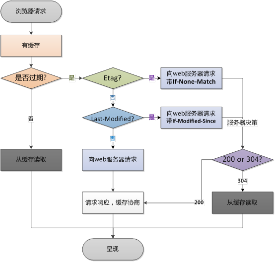
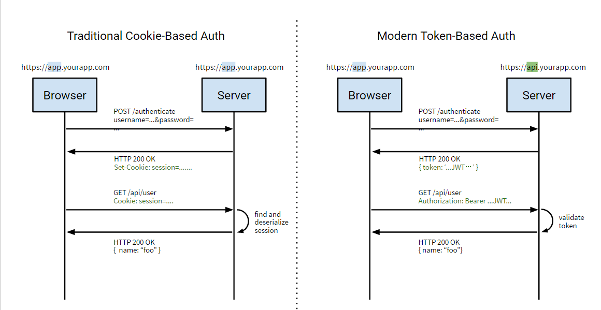
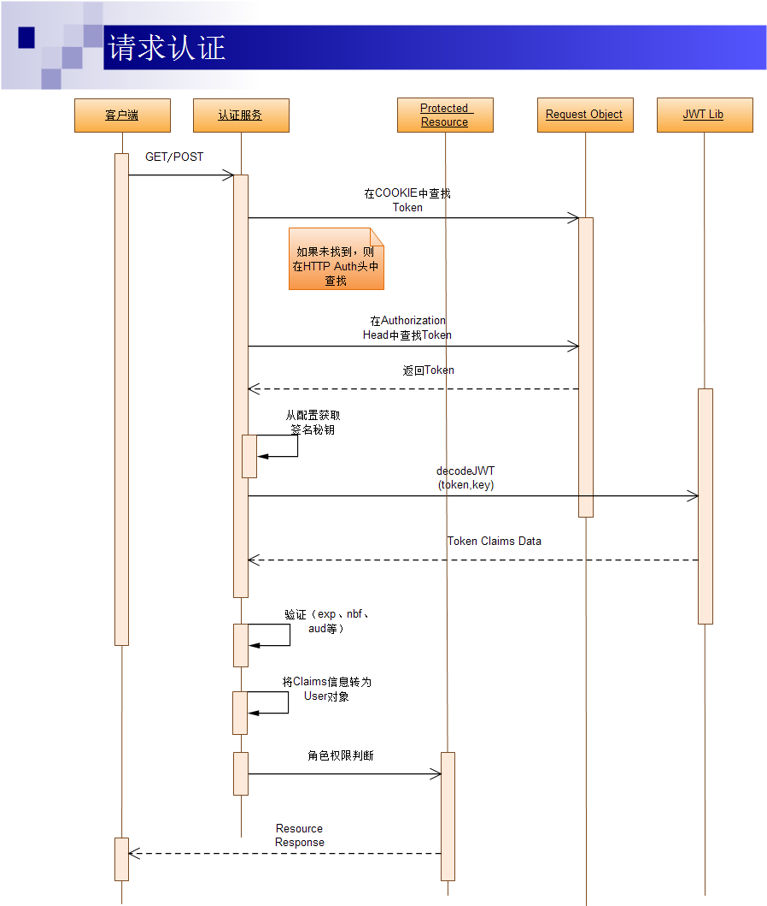

[TOC]
# 1. 和浏览器客户端缓存相关的http请求

- Expires：过期时间
    + 表示在指定时间后浏览器缓存失效
    + 这里的时间必须是GMT格式的时间格式
    + 使用Expires过期时间要求服务器的时间必须是正确的


- Cache-Control:缓存控制
    + 控制缓存
    + 值分为：
        + 1.max-age=[秒]:类似于过期时间,是相对于请求时间的间隔时间
        + 2.s-max-age=[秒]:与max-age相似。除了它应用于共享
        + 3.public: **仅体现在响应头**,通知浏览器可以无条件的缓存,标记认证的内容也可以缓存
        + 4.private:**仅体现在响应头**,通知浏览器只针对单个用户缓存,并且可以具体指定某个字段;如`private-"username"`
        + 5.no-cache:**强制每次请求之间都发送给源服务器** ,而且不经过本地缓存版本的校验,不管是否过期,这对于需要确认认证应用很有用,*或者是那些严格使用最新数据的应用*
            + 请求头中: 告诉浏览器回去服务器取数据, 并验证你的缓存(如果有的话)
            + 响应头中: 告诉浏览器, 一定要回服务器校验, 不管有没有缓存数据. 如果确定没有修改, 可以使用缓存中的数据
        + 6.no-store:告诉浏览器任何情况下都不要被缓存
        + 7.must-revalidate/proxy-revalidate:告诉浏览器和缓存服务器,本地副本过期前,可以使用本地副本,一旦过期，需要去源服务器进行有效性校验

> e.g. cache-control:max-age=3600,must-revalidate <br/>
 @ 一般出现在**请求头**中的cache-control:表示浏览器通知服务器本地没有缓存数据<br/>
 @ 出现在**响应头**中的cache-control:表示服务器告诉浏览器xxx时间内别来烦我
- Last-Modified / If-Modified-Since(/If-Unmodified-Since)
    + Last-Modified:某个地址的最后修改时间,是服务器返回给客户端的信息
    + If-modified-Since:**是浏览器返回给服务器端的**：告诉服务器最后一个的缓存为什么时间修改的,然后服务器可以判断客户端缓存的这么url地址的缓存是否为最新的,如果是最新的,则会*返回给浏览器304状态码*,如果发现url最后更新的时间比当前时间要新,那么会输出新的内容.

- ETag/If-None-Match(比较ETag是否不一致)
    - **ETag**与Last-Modified相似,不过它是用来标识url的版本的,如果url变了那么它也会跟着变化,在浏览器发If-modified-match 时告诉浏览器内容已经变了,或者没变可以使用缓存
    - list会自动给静态文 件加上ETag,在文件发声改变时重新生成ETag,**这样对于一个网站的静态资源只需要下载一次就够了,可以减轻负载**
        + Yahoo 建议谨慎使用Etag ：Yahoo建议分布式系统尽量关闭掉Etag(每台机器生成的etag都会不一样，因为除了 last-modified、inode 也很难保持一致)。


## 1.1 浏览器的缓存机制
<a name = "cache" id="cache"></a>
- 浏览器有两种缓存规则
    + 1. 强制缓存
    + 2. 对比缓存
```html
    1.首先要说明的是:强制缓存的优先级要高于对比缓存
    也就是说,在执行强制缓存时,如果缓存生效,那么直接
    使用缓存,不进行对比缓存


    2.浏览器第一次返回数据的数据的时候,会把缓存标识和数据
    一并发送到客户端,客户端将二者缓存到本地
    第二次请求的时候,客户端将缓存的标识发送给服务器
    服务器会根据缓存的标识进行判断：
    如果Last-Modified>If-modified-since:那么返回200 重新下载
    如果Last-Modified>If-modified-since:那么返回304 使用缓存

(优先级高于Last-modified)  如果比对ETag不用,那么返回200,重新下载资源
    如果比对Etag相同,那么返回304,使用缓存
```
> 即当本地副本根据Cache-Control/Expires发现还在有效期内时，则不会再发送请求去服务器询问修改时间（Last-Modified）或实体标识（ETag）了


<h4>1.第一次请求</h4>


<h4>2.第二次请求</h4>


<h4>3.另一个清晰解释</h4>


## 1.2 如果用户手动操作
> 通常来说,当用户**按下F5**进行刷新的时候,会忽略Cache-Control/expires, 会再次发送请求去服务器请求 (携带ETag/if-modified-since),服务器决定返回304还是200<br/>
而当用户按下ctrl+f5进行强制刷新的话,所有的缓存机制都将失效,所有资源重新去服务器重新请求

# 2. HTTP请求过程解析

## 2.1 HTTP请求格式
- a. 请求行
- b. 请求头
- c. 空行
- d. 消息体

<h4>一、请求行</h4>

> 请求行：通常是由**请求方法**(`GET,POST,PUT,DELETE,HEAD,CONNECT,TRACE`),**请求资源的URI路径**和**HTTP版本号**组成
- GET
- POST
- PUT :向web服务器发送数据**并存储在web服务器内部**
- HEAD:检查一个对象是否存在
- DELETE: 从web服务器上删除一个文件
- CONNECT: 对通道提供支持
- TRACE: 跟踪到服务器的路径
- OPTIONS ：查询web服务器的性能


```html
    GET / index.html HTTP / 1.1
```
<h4>二、请求头</h4>

> HTTP请求头可以使三种 <br/>1) **request header** 请求头  <br/>2) **General Header** 普通头 <br/> 3) **entity header** 实体头
- 其中实体头在`get`请求中不会存在,只在`post`请求中存在

- 请求头中中的信息有<a href="#cache">缓存</a>相关的信息,客户端身份信息等等
    + IF-Modified-Since
    + Cache-Control
    + User-Agent
    + Cookie
    + Accept : 指定客户端能够接收的内容类型
    + Accept-language：指定浏览器用来展示返回内容所显示的语言
    + Accept-encoding: 指定浏览器能够接受服务器返回内容的压缩编码类型
    + Accept-Charset: 浏览器可以接收的字符编码集
    + Content-Type: 显示此次HTTP请求提交的内容类型(**一般只用于POST**)，有两种编码类型
        - `application/x-www-form-urlencoded`:表单数据向服务器提交数据所采用的编码类型
        - `mutipart/form-data`：文件上载时所采用的编码类型
    + Referer：包含一个URL,用户从该url代表的页面出发访问当前请求的页面

<h4>三、消息体</h4>
> 消息体：请求体是客户端发给服务端的请求数据，这部分数据并不是每个请求必须的。

## 2.2 HTTP响应格式
- a. 状态行
- b. 响应头
- c. 空行
- d. 消息体

<h4>一、状态行</h4>  
> 状态行有HTTP版本号,状态码,以及状态说明
```html
    HTTP/1.1 200 OK
```
<h4>二、响应头</h4>  
> 响应头用于说明服务器的一些信息，以及将来继续访问该资源的策略
```html
    Connection:keep-alive
    Content-Encoding:gzip
    Content-Type:text/html; charset=utf-8
    Date:Fri, 24 Jun 2016 06:23:31 GMT
    Server:nginx/1.9.12
    Transfer-Encoding:chunked
```

- 1) Allow：服务器支持哪些请求方法(如GET、POST等)。

- 2) Content-Encoding：
> 文档的编码(Encode)方法。只有在解码之后才可以得到Content-Type头指定的内容类型

- 3) Content-Length：
> 表示内容长度。只有当浏览器使用持久HTTP连接时才需要这个数据。

- 4) Content- Type：
> 表示后面的文档属于什么MIME类型。Servlet默认为`text/plain`，**但通常需要显式地指定为**`text/html`。

- 5) Date：
> 当前的GMT时间，例如，Date:Mon,31Dec200104:25:57GMT。Date描述的时间表示世界标准时，换算成本地时间，需要知道用户所在的时区。

- 6) Expires：
> 告诉浏览器把回送的资源缓存多长时间，-1或0则是不缓存。

- 7) Last-Modified：
> 文档的最后改动时间。客户可以通过If-Modified-Since请求头提供一个日期，该请求将被视为一个条件GET，只有改动时间迟于指定时间的文档才会返回，否则返回一个304(Not Modified)状态。


- 8) Location：这个头配合302状态码使用，用于重定向接收者到一个新URI地址。表示客户应当到哪里去提取文档。Location通常不是直接设置的，而是通过HttpServletResponse的sendRedirect方法，该方法同时设置状态代码为302。

- 9) Refresh：
> 告诉浏览器隔多久刷新一次，以秒计。

- 10) Server：
> 服务器通过这个头告诉浏览器服务器的类型

- 11) Set-Cookie：
> 设置和页面关联的Cookie。

- 12) Transfer-Encoding：告诉浏览器数据的传送格式。

- 13) WWW-Authenticate：客户应该在Authorization头中提供什么类型的授权信息?

- 14) X-Requested-With: 标识Ajax请求


# 3.TCP特性

- TCP提供一种**面向连接**的,**可靠的**字节流服务
- 在一个TCP连接中,仅有两方进行通信
- TCP使用校验、确认和重传机制来保证可靠运输
- TCP给数据分节进行排序,并使用累计确认保证数据的不变和非重复
- TCP使用滑动窗口机制来实现流量控制,通过动态改变窗口的大小实现拥塞控制

> 注意:TCP不能保证数据一定会被对方接收到，TCP能做到的就是如果有可能，就把数据送到接受方，否则就通知用户

## 3.1.TCP连接的三次握手

### 3.1.1 什么是三次握手
所谓三次握手,就是建立一个TCP连接时,需要服务器和客户端总共发送三个包<br>

> 三次握手的目的：连接服务器的指定端口,建立TCP连接,并同步连接双方的确认号和确认号,并交换TCP窗口大小信息.在socket编程中,客户端执行`connect()`将触发三次握手


### 3.1.2 三次握手

- 第一次握手(SYN = 1 ,seq = x):
    + 客户端发送一个TCP的SYN标志位置1的包,指明客户端打算连接的服务器端口,以及序列号X,保存在包头的序列号seq(Sequence Number)中
> 发送完毕后,客户端进入SYN_SEND状态

- 第二次握手(SYN = 1,ACK = 1,seq = y,ACKnum = x + 1)
    + 服务器发回确认包(ACK)应答。即SYN和ACK标志位均为1.服务器端选择自己的ISN序列号，放到seq域里,同时将确认序列号设置为客户的ISN+1
> 发送完毕后,服务器进入SYN_RCVD状态

- 第三次握手(ACK=1,ACKnum = y + 1 )
    + 客户端再次发送确认包.即SYN标志位为0,ACK为1 ,并且把服务器发来的序列号字段+1,放在确认字段中发送给对方
>   发送完毕后,客户端进入ESTABISHED状态,当服务器端接收到了这个包的时候,也进入ESTABLISHED状态, 握手结束


## 4. 基于Token的Web后台认证机制

### 4.1 几种常用的认证机制

#### 4.1.1 HTTP Basic Auth
> 简单来说这种方式就是在每次进行API请求的时候都提供用户的`username`和`passowrd`,**但是有暴露信息的风险**

#### 4.1.2 OAuth
> `开放授权`:一个开放的授权标准, 允许第三方应用访问用户存放在某一web服务器的私有的资源,**无需提供用户名和密码**,*流程如下*: 


> 不适用于**自有认证权限**的企业应用

#### 4.1.3 Cookie Auth
> `Cookie`认证机制就是为一次请求认证在服务器端创建一个`Session`对象,通过用户带上来的`Cookie(携带有服务器端种下的SessionID)`与服务器端的Session匹配进行状态管理
- 这种方法安全性不高,且不能进行跨域
- 一般如何解决通过这种方式的跨域问题

#### 4.1.4 Token Auth


- Token可以放在`Cookie`中
    + 可以指定`httponly`,也可以指定`security`
- 存放于`localstorage`中
    + 将token存放于`localstorage`中，但是有**XSS攻击**的风险,需要应用程序保证`token`只在`HTTPS`下传输     

<h4>一：安全的请求方式</h4>
   
> 1.在HTTP请求时，可以在form表单中加上一项`<input type="hidden" value="your token">`，提交给后台校验提交的token是否和cookie中的token一致。接受表单的同时确认`token`的有效性<br/>
2.放在`form的隐藏域`或者具有`http_only`属性的cookie字段中也是可以的

<h4>二：一般存放格式</h4>

```html
用户名：明文存放。 
登录序列：一个被MD5散列过的随机数，仅当强制用户输入口令时更新（如：用户修改了口令）。 
登录Token：一个被MD5散列过的随机数，仅一个登录Session内有效，新的登录Session会更新它。
```  

<h4>三：认证过程</h4>   

- **登录**
    + 第一次认证：第一次登录，用户从浏览器输入用户名/密码，提交后到服务器的**登录处理的Action层**（Login Action）；
    + Login Action调用认证服务进行用户名密码认证，如果认证通过，Login Action层调用用户信息服务获取用户信息（包括完整的用户信息及对应权限信息）；
    + 返回用户信息后，Login Action从配置文件中获取Token签名生成的秘钥信息，进行Token的生成；
    + 生成Token的过程中可以调用第三方的JWT Lib生成签名后的JWT数据；
    + 完成JWT数据签名后，**将其设置到COOKIE对象中**，并重定向到首页，完成登录过程；
    
    
- **请求认证**
<br/>基于token的请求认证每一次请求都会附带上`token`字段,这个Tokenx信息可能会在`cookie`中或者是 HTTP的`Authorization`中
    + 客户端（APP客户端或浏览器）通过GET或POST请求访问资源（页面或调用API）
    + 认证服务作为一个Middleware HOOK 对请求进行拦截，首先在cookie中查找Token信息，如果没有找到，则在HTTP Authorization Head中查找；
    + 如果找到Token信息，则根据配置文件中的签名加密秘钥，调用JWT Lib对Token信息进行解密和解码；
    + 完成解码并验证签名通过后，对Token中的exp、nbf、aud等信息进行验证；
    + 全部通过后，根据获取的用户的角色权限信息，进行对请求的资源的权限逻辑判断；
    + 如果权限逻辑判断通过则通过Response对象返回；否则则返回HTTP 401；
    


