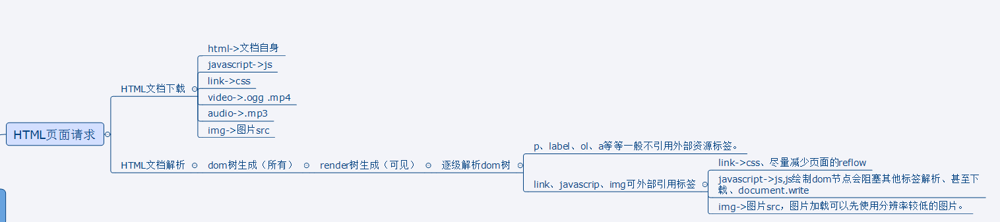

[TOC]
# 网站性能优化学习

## DNS寻址以及IP解析

- 域名实际上是解析成了对应的IP进行访问的
- DNS就是IP地址的别名 `localhost=127.0.0.1`
- 301跳转以及302跳转的区别
    - 301:(redirect)是永久性重定向,搜索引擎在抓取新内容的同时也将旧的网址重定向为新的网址
    - 302：是暂时性重定向,当一个网页经历过短期URL变化时使用,
- 域名是如何解析的
    - 作用:标记站点的职能
    - **解析方法是从右向左的**,"news.baidu.com."-->先解析的是"."
- 304 是什么呢?
    - Not Modified 客户端有缓冲的文档并发出了一个条件性的请求（一般是提供If-Modified-Since头表示客户只想比指定日期更新的文档）。**服务器告诉客户，原来缓冲的文档还可以继续使用。**
> 如果客户端在请求一个文件的时候，发现自己缓存的文件有 Last Modified ，那么在请求中会包含 If Modified Since ，这个时间就是缓存文件的 Last Modified 。
> 因此，如果请求中包含 If Modified Since，就说明已经有缓存在客户端。只要判断这个时间和当前请求的文件的修改时间就可以确定是返回 304 还是 200 。对于静态文件，例如：CSS、图片，服务器会自动完成 Last Modified 和 If Modified Since的比较，完成缓存或者更新。但是对于动态页面，就是动态产生的页面，往往没有包含 Last Modified 信息，这样浏览器、网关等都不会做缓存，也就是在每次请求的时候都完成一个 200 的请求。 


## webserver背后的事情
- TCP是传输协议(IP处于TCP层),查到的IP通过传输协议传输数据
- 怎样标记网站上登录还是未登录状态
    - 登录的时候服务器给本地种了一个**cookie**,这个cookie每次请求都会代理服务器,所以当用户**带着这个cookie请求页面的时候**,服务器就会去查数据等等然后返回给登录用户

## 前端页面渲染流程
- 首先会把HTML文档下载下来 
- 然后会经历：HTML文档解析-->生成DOM树(所有)-->render树生成(可见)(上一层生成DOM树已经生成结构)("vibisility占据位置处于render树中")-->逐级解析DOM树 
    - 如果某个标签中有外部的资源 那么就会发起新的请求去加载资源;如果没有就会把文章中的内容或者一些变量填充到render树中
    - js绘制dom节点会**阻塞其他标签的解析**,还会至少*阻塞一条下载通道*
    - **措施**:
        - 1 **减少页面的reflow(回流)**,当页面结**构发生改变**的时候,render树是会被重绘的
        - 2 当src指向的图片比较大的图片会*占用下载通道较长的时间*，可以**先用一些分辨路较低的图片占着位置**,让用户可以看到大概是什么样子的,当下载结束后用户就可以看到一个比较清晰的图片

### [回流，重绘理解]( http://www.css88.com/archives/4996)
- reflow：页面元素的规模尺寸，布局，隐藏等改变而需要重新构建，每个页面至少进行一次回流页面刚加载的时候，
- repaint：页面元素属性发生改变，比如颜色，风格等。。。
- 什么时候会发生回流重绘
**只要页面中元素尺寸发生变化就一定会发生回流**
1.  添加或者删除可见的DOM元素；
2. 元素位置改变；
3. 元素尺寸改变——边距、填充、边框、宽度和高度
4. 内容改变——比如文本改变或者图片大小改变而引起的计算值宽度和高度改变；
5. 页面渲染初始化；
6. 浏览器窗口尺寸改变——resize事件发生时；

> 回流一定会发生重绘，重绘不一定会发生回流




### [阻塞的状况](http://www.cnblogs.com/chenjg/p/7126822.html)
**css和js在解析过程中都会产生阻塞**
js阻塞：页面在解析过程中只要碰到script标签就会停下来等js运行结束后向下执行
css阻塞：
1. css加载不会阻塞DOM树的解析
2. css加载会阻塞DOM树的渲染
3. css加载会阻塞后面js语句的执行

**阻塞优化**
1. 使用CDN(因为CDN会根据你的网络状况，替你挑选最近的一个具有缓存内容的节点为你提供资源，因此可以减少加载时间)
2. 对css进行压缩(可以用很多打包工具，比如webpack,gulp等，也可以通过开启gzip压缩)
3. 合理的使用缓存(设置cache-control,expires,以及E-tag都是不错的，不过要注意一个问题，就是文件更新后，你要避免缓存而带来的影响。其中一个解决防范是在文件名字后面加一个版本号)
4. 减少http请求数，将多个css文件合并，或者是干脆直接写成内联样式(内联样式的一个缺点就是不能缓存)   


# 35条黄金定律

## 网页内容

### 减少HTTP请求
- 捆绑文件:现在很多库可以帮你把多个脚本文件绑定在一起,减少文件的下载次数
- CSS精灵图
- Image Maps:将多副图片拼接在一起，通过坐标来显示导航(还未实践过)
-  Inline images: 通过编码的字符串将图片内嵌到网页文本中(未实践)


### 减少DNS查询
> 如果网站的资源来自多个域名,那么客户端在首次解析Domain上就会花费一段时间,*访问过后的结果会缓存在本地和浏览器一段时间*

### 避免页面跳转

> 当客户端收到服务器的跳转回复时，客户端再次根据服务器回复中的location指定的地址再次发送请求，例如以下跳转回复。网站会一直跳N次,体验也不好
```html
 HTTP/1.1 301 Moved Permanently
 Location: http://example.com/newuri
 Content-Type: text/html
```

### 缓存Ajax

> Ajax可以帮助我们异步的下载网页内容，但是有些网页内容即使是异步的，用户还是在等待它的返回结果，例如ajax的返回是用户联系人的下拉列表。所以我们还是要注意尽量应用以下规则提高ajax的响应速度。

```html
添加Expires 或 Cache-Control报文头使回复可以被客户端缓存
压缩回复内容
减少dns查询
精简javascript
避免跳转
配置Etags

```


